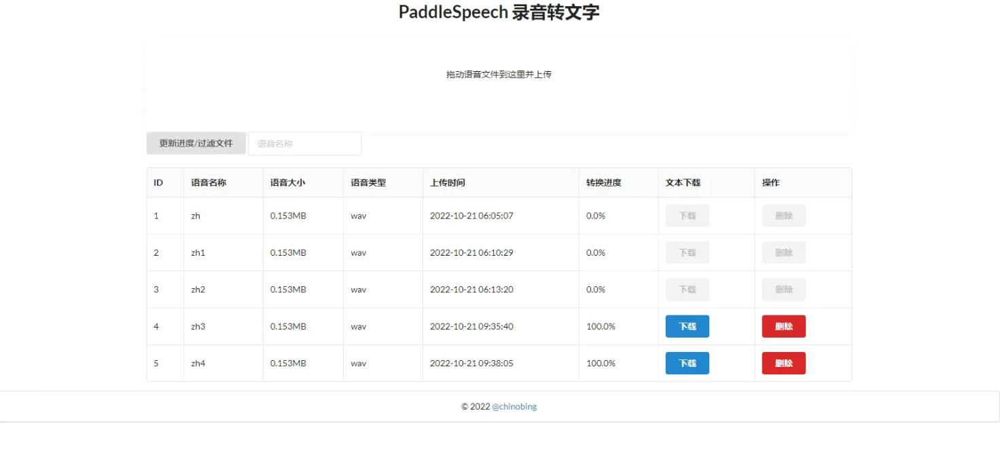

# FastAPI PaddleSpeech 语音转文字
## 目的
最近尽调项目较多， 而且因为疫情原因而转至腾讯电话会议进行访谈，为了节省会议记录的时间，我将会议内容进行了录音（合法的情况下）并转换为文字的形式方便整理笔记。 我试过不同的现成产品，要么是收费贼贵，要么转换质量慎忧，于是乎，还是自己弄一个比较直接。

## 功能
- 文件上传，分割(由于PaddleSpeech的限制，文件将分割至数个59秒的音频文件)
- 转换进度显示
- 音频自动转换至合适格式
- 后台更新任务
- 以csv格式输出

## 技术
- FastAPI 用于前端网页
- FFmpeg 用于转换、分割音频
- PaddleSpeech 用于音频转换
- Celery 用于后台任务

## demo

**注意**：首次运行需要初始化，可能会转换失败。 

## 过程&思路
1. 先从网页的具体功能入手， 想要实现哪些功能（例如首页显示音频文件的基本信息、上传区域、文件过滤功能）
2. 基于上述的功能，开始建立数据库（锁定使用sqlalchemy，sqlite3）；
    - 既然使用到数据库，首先创建`database.py`用于初始化`sqlalchemy，sqlite3`
    - 新建`models.py`用于数据字段的创建，我最开始是先创建了`Audio`数据表用于记录上传文件的信息，`Data`数据表是后来要实现paddlespeech的转换功能才添加进去的，然后以`audio_id`作为两个数据表的关联字段。
    `schemas.py`里面是用到了pydantic的， 这里主要是数据的输入、输出都希望遵循到pydantic的格式，这是fastapi独有的
    - 数据表之后就是新建`crud.py`用于数据库的写入和读取（最开始是不清楚需要什么写入和读取function的，后续慢慢地添加进去）
3. 大的框架有了之后，就开始设计html展示页面，这里用到了jinja2而不是vue.js等前后端分离哦技术（主要考虑到学习成本）
4. 通过`dropzone.js` 实现了drag&drop上传文件的功能，然后后端利用FastAPI post响应，这里后端是通过`FastAPI BackgroundTasks`来实现后台FFmpeg分割音频文件的功能。 但音频转文字的功能非常好耗时，所以不能用`BackgroundTasks`来实现，所以后续引入了`Celery`来解决。 (`Celery`这里有个大坑，就是传递的任务参数中不能有`object类型`的，我试传递了`sqlalchemy Session` 和 `Path路径`都是失败)
5. 最后就是弄dockkerfile 和 `docker-compose.yml`文件

## 参考
- [Asynchronous Tasks with FastAPI and Celery](https://testdriven.io/blog/fastapi-and-celery/)
- [高性能 FastAPI 框架入门精讲](https://www.imooc.com/learn/1299)